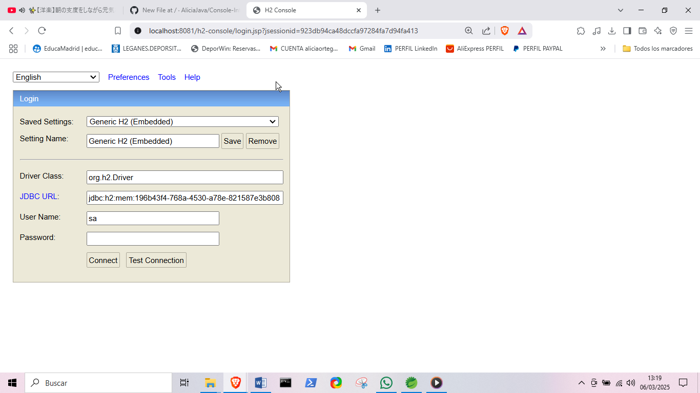

# Console-H2.DataBase

Este proyecto utiliza **H2 Database** embebido en memoria y está integrado con **Spring Boot**, **Spring Data JPA** (Hibernate) y **Thymeleaf** para crear una base de datos en memoria de desarrollo. Esta base de datos está destinada solo para propósitos de desarrollo y pruebas, no es adecuada para producción.

La base de datos se crea automáticamente a través de la clase `Entity` con **Data JPA** y **Hibernate**. La tabla se mapea mediante anotaciones que permiten crear el esquema de la base de datos al iniciar el proyecto. La interfaz de usuario está construida con **Spring Web (MVC)** y **Thymeleaf**.

## Dependencias

Este proyecto utiliza las siguientes dependencias:

- **Spring Boot DevTools**: Herramientas de desarrollo para mejorar la experiencia de desarrollo.
- **H2 Database**: Base de datos embebida en memoria, utilizada solo para desarrollo.
- **Spring Data JPA (Hibernate)**: Para facilitar el acceso a la base de datos mediante JPA y Hibernate.
- **Thymeleaf**: Motor de plantillas para generar vistas en el servidor.
- **Spring Web (MVC)**: Para manejar solicitudes HTTP y renderizar vistas con Thymeleaf.

Instala Maven para gestionar dependencias.

## Pasos para ejecutar el proyecto

1. **Clona el repositorio**:

   ```bash
   git clone https://github.com/tu-usuario/Console-H2.DataBase.git
   cd Console-H2.DataBase

2. **Configura la base de datos**:

El proyecto ya está configurado para utilizar H2 en memoria. No es necesario realizar ninguna configuración adicional para la base de datos. 
Esta se creará automáticamente a través de las clases Entity mapeadas por JPA y Hibernate.

3. **Ejecuta el proyecto**:

Para ejecutar la aplicación, utiliza el siguiente comando:
mvn spring-boot:run

Utiliza RUN US desde STS IDE ECLIPSE


4. **Acceso a la Consola H2**
Una vez que el proyecto esté en ejecución, dirígete a la siguiente URL en tu navegador:
<http://localhost:8080/h2-console>


En la pantalla de acceso, configura la conexión con la siguiente URL JDBC que se genera automáticamente cada vez que inicias el proyecto.

Ejemplo de URL JDBC:
jdbc:h2:mem:196b43f4-768a-4530-a78e-821587e3b808

1. **El resto de los campos pueden dejarse por defecto**:

Driver Class: org.h2.Driver
User Name: sa
Password: (Deja este campo vacío o usa sa como contraseña por defecto)
Haz clic en "Connect" para acceder a la consola de la base de datos.

Nota: La URL JDBC cambia cada vez que se reinicia la aplicación, por lo que deberás copiar la nueva URL de la consola cada vez que reinicies el proyecto.

**Descripción de las carpetas y archivos**:

**ConsoleH2Application.java**: Clase principal de la aplicación.
**controller/**: Contiene los controladores de Spring MVC para gestionar las solicitudes.
**entity/**: Contiene las clases Entity que se mapean a las tablas de la base de datos.
**repository/**: Contiene las interfaces de repositorios que interactúan con la base de datos.

**Pasos a seguir para usar la consola H2**:

2. **Ejecuta el proyecto**:

Al ejecutar el proyecto, se generará un código único que se debe utilizar en la URL JDBC para conectarse a la base de datos en memoria desde la interfaz de usuario de H2 Console.

3. **Ejemplo de salida en la consola de ejecución**:

H2 console available at '/h2-console'.
Database available at 'jdbc:h2:mem:196b43f4-768a-4530-a78e-821587e3b808'


4. **Accede a la consola de H2**:

El puerto en el que está corriendo la aplicación es 8081 (puerto Tomcat). La URL de la consola será:

http://localhost:8081/h2-console/



5. **Conéctate a la base de datos**:

Una vez accedas a la consola H2, completa los campos de la siguiente manera:

JDBC URL: Copia y pega la URL generada por el proyecto, algo similar a:

jdbc:h2:mem:196b43f4-768a-4530-a78e-821587e3b808

- **USER NAME**: sa
- **PASSWORD**: Déjalo vacío.

Luego, haz clic en **"Test Connection"** para verificar la conexión.


6. **Conéctate a la base de datos**:

Después de que la conexión haya sido verificada, haz clic en "Connect".

7. **Ver la tabla clientes**:

Una vez que estés conectado, verás la tabla clientes. Haz clic en ella para visualizar los datos guardados.


8. **Ejecuta la consulta para ver los datos**:

Finalmente, para ver los datos almacenados en la tabla clientes, haz clic en "Run".


Esto mostrará los datos que se han guardado en la base de datos a través del archivo de propiedades.
